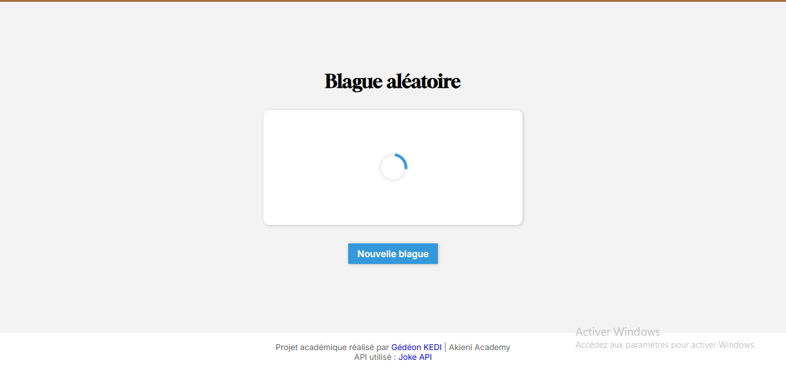
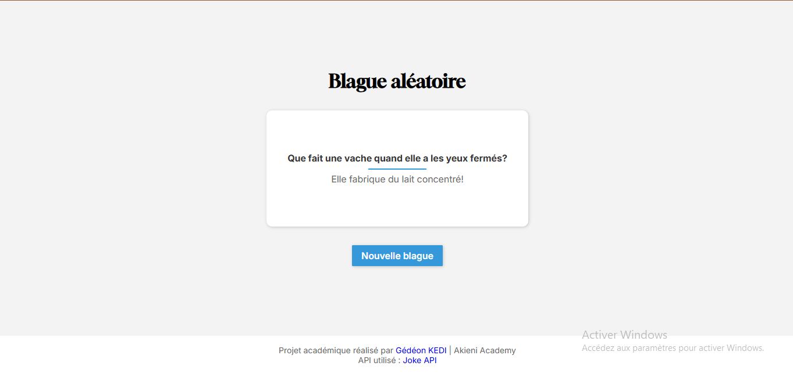
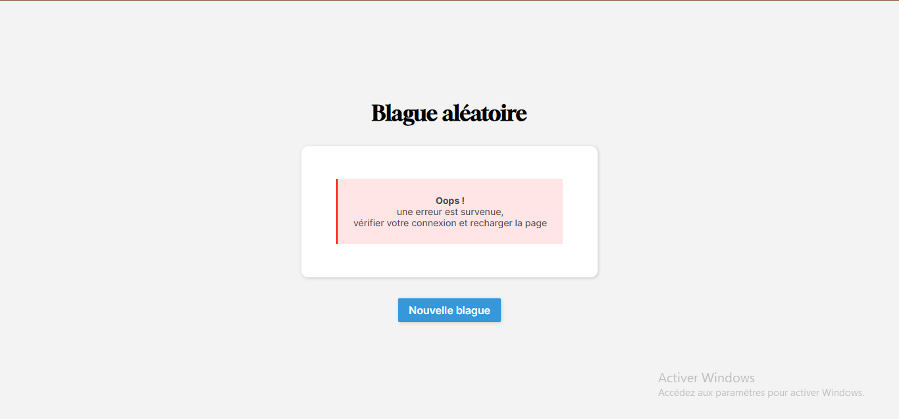

# blague-aleatoire

Projet JavaScript débutant : récupération et affichage d’une blague aléatoire via une API publique, avec gestion des états chargement, succès et erreur.

## Fonctionnalités

- Récupération d’une blague aléatoire via l’API JokeAPI
- Affichage de la blague dans la page
- Affichage d’un loader pendant le chargement
- Gestion des erreurs en cas de problème lors de la récupération de la blague

## Technologies utilisées

- HTML
- CSS
- JavaScript
- Fetch API
- JokeAPI

## Aperçu

### État de chargement

Le loader est affiché pendant la récupération de la blague.



### État de succès

Une fois la blague récupérée, elle est affichée sur la page.



### État d'erreur

Un message d’erreur est affiché lorsque la récupération de la blague échoue.



## API utilisée

Le projet utilise [JokeAPI](https://v2.jokeapi.dev/) pour récupérer les blagues.

## Installation

Cloner le projet puis ouvrir le fichier `index.html` dans un navigateur.

```bash
git clone https://github.com/G-Kedi/blague-aleatoire.git